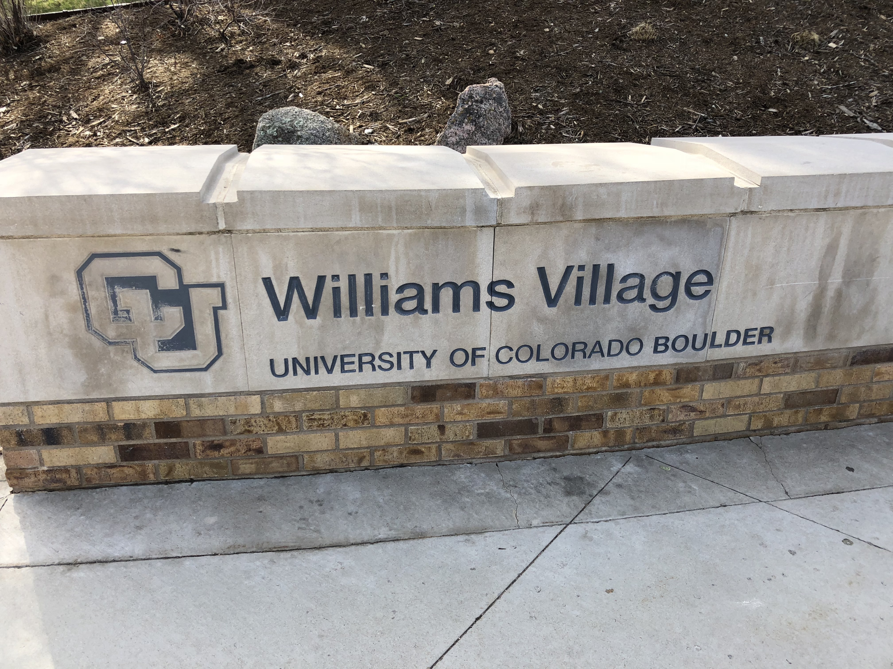

<h1>Welcome</h1>

This website aims to answer one simple question:

<blockquote><strong>How do I get to the 2018 Colorado Aspirations in Computing Awards?</strong></blockquote>

I'm glad you asked!

This year the awards event is being held in a place with an unbelievably cool name: <strong>The Multipurpose Room</strong>.

That's right, this room has MANY purposes and ONE of them is to host awards events. That's a good thing too, given why we are coming together on Saturday!

Where is this multipurpose room located?

In a far-off place, known as Williams Village at the University of Colorado Boulder.

