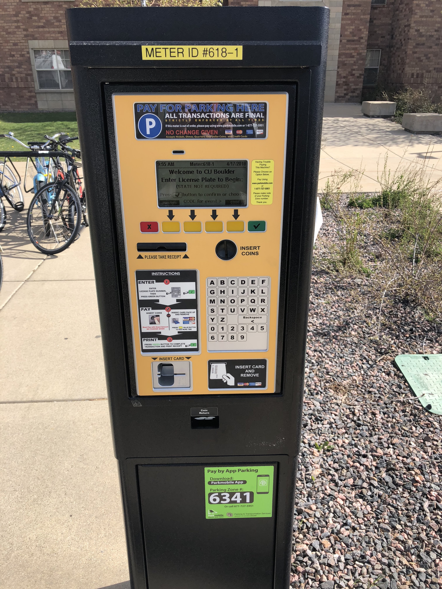

<h1>Welcome</h1>

The 2018 Colorado Aspirations in Computing Awards will be held on Saturday, April 28, 2018! We hope you're excited as we are for the event!

The program starts at 1 PM; you should arrive at 12:30 PM-ish to check in and get settled before everything gets underway. But, you probably have a question:

<blockquote class="blockquote text-center">
  
<strong>How did Prof. Anderson make this website?</strong>

</blockquote>

No, not that question! Try again:

<blockquote class="blockquote text-center">
  
<strong>How do I get to the 2018 Colorado Aspirations in Computing Awards?</strong>

</blockquote>

I'm glad you asked!

This year the awards event is being held in a place with an unbelievably cool name: <strong>The Multipurpose Room</strong>.

That's right, this room has MANY purposes and ONE of them is to host awards events. That's a good thing too, given why we are coming together on Saturday!

Where is this multipurpose room located?

In a far-off place, known as Williams Village at the University of Colorado Boulder.

When most people think of Williams Village, they think of these lovely, aesthetic, um, orange buildings that everyone sees when they drive into Boulder

  

    

      

        
      

      

        
      

      

        
      

    

    <a class="carousel-control-prev" href="#orange_buildings" role="button" data-slide="prev">
      
      Previous
    </a>
    <a class="carousel-control-next" href="#orange_buildings" role="button" data-slide="next">
      
      Next
    </a>
  

&nbsp;

These are NOT the buildings you are looking for. If you see this sign:

then you have found the WRONG building.

Fortunately, all you have to do is look to your left and you will see the CORRECT building!

Unfortunately, you're standing on the north side of the building and you want to be on the southwest side of the building. If you go there, you'll see this sign:

And, you will know you're almost there. The building you're looking for looks like this from the south:

If you go through those doors, then, <strong>CONGRATS</strong>, you've found the 2018 Colorado Aspirations in Computing Awards!

<h1>Parking</h1>

Now, hold on a minute. You can't very well walk through those doors if you haven't found a place to park! So, what are your options?

Your options:

<ul>
  <li>Blue: Go to this lot and pay for parking.</li>
  <li>Orange: Try to find parking along this street.</li>
  <li>Green: Try to find parking in this shopping center across the street.</li>
  <li>Red: This is the building you're looking for. You can't park on a building.</li>
  <li>Final Option: Head North!</li>
</ul>

<h2>Paid Parking Lot</h2>

If you want to pay for parking, head to the lot highlighted in blue. You'll see this sign when you're in the right place:

as well as this sign:

Once parked (if there is a spot available), then use this simple, well-designed parking station to pay for parking:

Then head towards the southwest side of this building:

and head through the magic doors!

<h2>30th Street</h2>

The orange line on the map is 30th Street; it looks like this facing east:

and like this, when facing west:

If there is a spot available, you should be able to park there.

<h2>Shopping Center</h2>

If you can't find parking in the paid lot or on 30th, you can try to park over at the shopping center across the street. It looks like this:

and this:

and comes with its own slightly agressive parking sign:

(What is up with the designers of parking lot signs?)

I've parked in this parking lot many times for events in Williams Village and have never had a problem. However, your mileage may vary.

<h2>Heading North</h2>

The last option is to head north on 30th street:

Up this street, on the left and right, are many neighborhoods with (mainly) student housing. You should be able to find parking in these neighborhoods as a last resort. You will then have to walk south and find the magic doors on the southwest side of the building marked in red!

<h1>Wrapping Up</h1>

I hope you found this information useful and I wish you much success on your parking-related Odyssey. My team and I cannot wait to see you and your family so we can celebrate your accomplishments in computing!!

See you soon!

